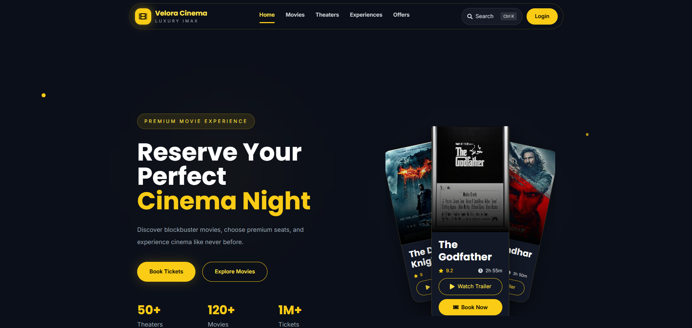

<div align="center">

# 🎬 Velora Cinema

### Luxury IMAX Movie Booking Platform

A modern full-stack movie booking web application with a premium cinema-inspired UI, secure authentication, seat booking, and an immersive user experience.

**Live Demo:** https://velora-cinema.vercel.app/

**Backend API:** https://velora-backend-v3yj.onrender.com

</div>

---

## Preview

> Premium dark-themed interface inspired by luxury cinema experiences.



---

## Features

### User Experience

- Premium luxury cinema UI
- Fully responsive design
- Smooth Framer Motion animations
- Interactive movie carousel
- Dynamic featured banners
- Beautiful movie detail pages

### Booking System

- Browse available movies
- View show timings
- Select theaters
- Interactive seat selection
- Booking summary
- Digital ticket generation

### Authentication

- User Registration
- Secure Login
- JWT Authentication
- Protected Routes

### Admin Features

- Movie Management
- Theater Management
- Show Management
- Booking Management

---

## Tech Stack

| Frontend | Backend | Database |
|----------|---------|----------|
| React 19 | Node.js | MongoDB Atlas |
| Vite | Express.js | Mongoose |
| Tailwind CSS | JWT | |
| Framer Motion | Bcrypt | |
| React Router | CORS | |

---

## Project Structure

```text
Velora Cinema/
│
├── backend/
│   ├── config/
│   ├── controllers/
│   ├── middleware/
│   ├── models/
│   ├── public/
│   ├── routes/
│   ├── utils/
│   ├── server.js
│   └── package.json
│
├── frontend/
│   ├── src/
│   │   ├── admin/
│   │   ├── assets/
│   │   ├── components/
│   │   ├── context/
│   │   ├── data/
│   │   ├── hooks/
│   │   ├── layouts/
│   │   ├── pages/
│   │   ├── services/
│   │   └── styles/
│   └── package.json
│
└── README.md
```

---

## Screens

### Home

- Premium Hero Section
- Floating Movie Posters
- Featured Banner
- Animated Statistics

### Movies

- Movie Grid
- Hover Effects
- Trailer Preview
- Dynamic Poster Loading

### Movie Details

- Fullscreen Hero Banner
- Cast Section
- Highlights
- Gallery
- Showtime Selection

### Seat Booking

- Interactive Seat Selection
- Live Booking Summary
- Responsive Layout

---

## Installation

### Clone Repository

```bash
git clone https://github.com/YOUR_USERNAME/velora-cinema.git
cd velora-cinema
```

---

## Backend Setup

```bash
cd backend
npm install
```

Create `.env`

```env
PORT=5000
MONGO_URI=YOUR_MONGODB_URI
JWT_SECRET=YOUR_SECRET_KEY
```

Run backend

```bash
npm run dev
```

Backend runs on

```text
http://localhost:5000
```

---

## Frontend Setup

```bash
cd frontend
npm install
```

Create `.env`

```env
VITE_API_URL=http://localhost:5000/api
```

Run frontend

```bash
npm run dev
```

Frontend runs on

```text
http://localhost:5173
```

---

## Deployment

| Service | Platform |
|----------|----------|
| Frontend | Vercel |
| Backend | Render |
| Database | MongoDB Atlas |

---

## API Endpoints

### Authentication

| Method | Endpoint |
|--------|----------|
| POST | `/api/auth/register` |
| POST | `/api/auth/login` |

### Movies

| Method | Endpoint |
|--------|----------|
| GET | `/api/movies` |
| GET | `/api/movies/:slug` |

### Theaters

| Method | Endpoint |
|--------|----------|
| GET | `/api/theaters` |

### Bookings

| Method | Endpoint |
|--------|----------|
| POST | `/api/bookings` |

---

## Performance Highlights

- Responsive across Desktop, Tablet, and Mobile.
- Smooth page transitions using Framer Motion.
- Optimized image loading.
- REST API architecture.
- Secure JWT-based authentication.
- Clean reusable component structure.

---

## Future Enhancements

- Email Ticket Confirmation
- Razorpay Payment Gateway
- Real-Time Seat Locking
- Admin Analytics Dashboard
- User Reviews & Ratings
- Search Suggestions
- Dark/Light Theme Toggle

---

## Skills Demonstrated

This project showcases practical experience with:

- React Component Architecture
- REST API Integration
- JWT Authentication
- MongoDB Database Design
- Express Backend Development
- Tailwind CSS UI Design
- Framer Motion Animations
- Full-Stack Deployment
- Responsive Web Development

---

## Author

### Ayush Verma

Electronics & Communication Engineering Student

Aspiring Full Stack Developer | DSA | Data Science Enthusiast

GitHub: https://github.com/YOUR_USERNAME

---

<div align="center">

### If you found this project interesting, consider giving it a ⭐

Built with ❤️ using React, Node.js, Express, MongoDB, and Tailwind CSS.

</div>